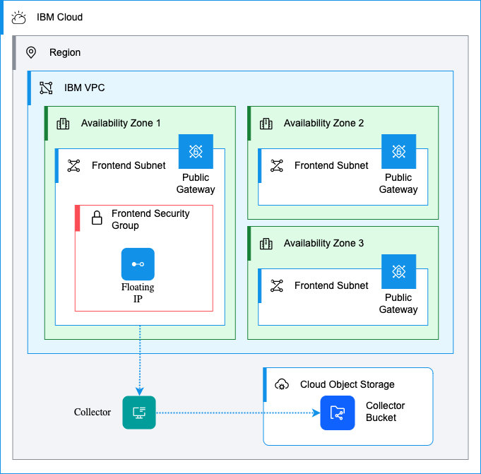

# Template repo for IBM Cloud VPC Terraform projects

This repository contains a template for creating new Terraform projects for IBM Cloud VPC related deployments. It is intended to be used as a starting point for new projects.



## pre-commit hooks

The following pre-commit hooks are defined in the `.pre-commit-config.yaml` file:

- terraform_fmt: Syntax checking for Terraform
- detect-secrets: Ensure we don't commit anything sensitive

### Install pre-commit

```shell
pip install pre-commit
```

### Install hooks

```shell
pre-commit install
```

### Add Secret to detect-secrets

To add new secrets to the existing baseline, run the following command:

```shell
detect-secrets scan --baseline .secrets.baseline
```

This will rescan your codebase, and:

- Update/upgrade your baseline to be compatible with the latest version,
- Add any new secrets it finds to your baseline, and remove any secrets no longer in your codebase
- Preserve any labelled secrets you have.

## Usage

To use this template, do the following:

1. Create a new repository using this template
2. Clone the new repository
3. Copy `tfvars-example` to `terraform.tfvars` and update the values as needed. This file is ignored by git so you won't accidentally commit it.
4. Run `terraform init` to initialize the project
5. Run `terraform plan` to see what changes will be made
6. Run `terraform apply` to apply the changes
